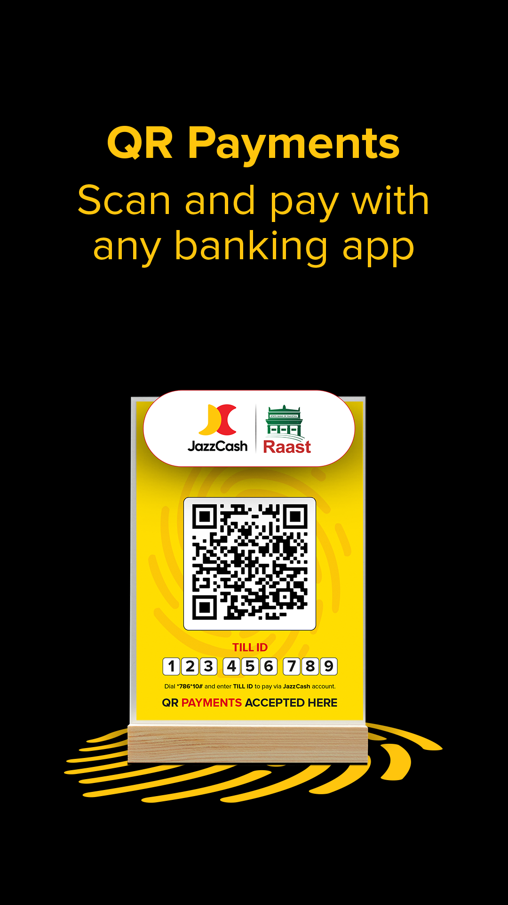

# jazzcash-case-study
Case study: JazzCash native mobile app — Android (Java/Kotlin) &amp; iOS (Swift). Role: Lead Developer
<h2 align="center">💸 JazzCash Mobile — Case Study (Android & iOS)</h2>

<p align="center">
  
</p>

---

> **Case Study – public summary only.** This repository contains documentation, screenshots and a high-level case study describing my work on the JazzCash mobile application. **No client source code, credentials, or private data is included.**

---

### 🌍 Overview

**JazzCash** is a large-scale mobile payments platform (native Android + native iOS) that provides payments, peer-to-peer transfers, bill payments, airtime, and financial services to millions of users. This repository is a public case study summarizing architecture concepts, key features, and my contributions as the **Lead Mobile Developer / Architect** on the project.

---

### 🛠️ Tech Stack (native implementation)

| Platform | Tech |
|---:|:---|
| Android | Java / Kotlin, Android SDK, Android Studio |
| iOS | Swift, Xcode |
| Backend (typical) | Spring Boot / .NET / Node — REST & gRPC APIs |
| Networking | Retrofit / OkHttp (Android), Alamofire (iOS) |
| Local Storage | Encrypted Room / Realm / CoreData |
| Security | TLS, OAuth2/JWT, AES encryption |
| Observability | Crashlytics / Sentry, Prometheus, Grafana |
| CI/CD | Jenkins / GitHub Actions, Fastlane |
| Dev Tools | Postman, Charles / Fiddler, Android Profiler, Xcode Instruments |

---

### ⚙️ High-level Flow (conceptual)

UI (Native Android / iOS) → Auth Module (OAuth2 / JWT) → API Gateway → Microservices (Payments, Accounts, Notifications) → External Partners (banks, PSPs)

---

### 🧩 Screenshots

> Screenshots are sourced from publicly-available assets (Play Store) or redacted mockups. Files are stored in `/screenshots`.


|---|---|---|
|  |  |  |


|---|---|---|
|  |  |  |

| Settings / Profile | Additional Screens |
|---|---|
|  | (See other images in `/screenshots`) |

---

### 📌 Architecture (visual only)

> The architecture section below contains only images (visual overview). No confidential diagrams or client internals are included.


---

### 💡 Key Features (delivered / overseen)

- Secure onboarding and multi-factor authentication flows.  
- Fast, reliable account balance and transaction retrieval with offline caching.  
- Peer-to-peer transfers with optimistic UI and robust reconciliation.  
- Bill payments and scheduled payments processing.  
- Transaction history with advanced filtering and search.  
- Push notifications for transactional events and security alerts.  
- Performance optimizations for app cold-start, memory, and network efficiency.  
- Monitoring and crash reporting integration for production stability.

---

### 👨‍💼 Role — Lead Mobile Developer (Detailed)

As the **Lead Mobile Developer & Architect** on the JazzCash mobile project I was responsible for design, delivery, and the technical leadership required to ship a secure, resilient, and high-performance production mobile product used at scale. Key responsibilities and actions I performed:

**1. Architectural design & technical ownership**
- Defined the mobile application architecture (native Android and iOS) focusing on modularity, separation of concerns, testability, and offline-first resilience.  
- Proposed and validated the overall flow: Presentation → Domain → Data → Integration, ensuring each layer had clear responsibilities.  
- Designed the offline queue/retry mechanism and local encrypted cache to allow critical flows (view balances, queue transfers) to work under intermittent connectivity.

**2. Security & compliance**
- Led implementation of secure authentication, session management and token lifecycle (refresh & revocation) with OAuth2/JWT best practices.  
- Introduced secure storage patterns (encrypted local DB, secure keystore / keychain) to keep tokens and sensitive data safe.  
- Coordinated with security and compliance teams to align with PCI/DSS recommendations for payment flows (redaction, logging controls, encryption at rest and transit).

**3. Native integrations & payments**
- Managed integration with payment gateways and bank SDKs — designed wrapper layers to isolate SDK specifics from app business logic.  
- Implemented end-to-end reconciliation strategies and idempotency controls for monetary transactions to avoid double-charges.

**4. Performance & reliability**
- Carried out performance profiling, reduced app cold-start time, optimized network layer (batching, caching, debounce), and reduced memory churn.  
- Implemented graceful degradation patterns and UI placeholders to improve perceived performance for low-bandwidth users.

**5. CI/CD, QA & release management**
- Established CI/CD pipelines for Android and iOS (build → test → deploy) using Jenkins / GitHub Actions + Fastlane for signing and automated releases.  
- Ran production-level pre-release QA cycles, implemented automated UI and integration tests, and set up crash & performance monitoring in staging and prod.

**6. Team leadership & process**
- Mentored and onboarded mobile engineers, ran architecture/PR reviews, and established coding standards and mobile best practices.  
- Coordinated cross-functional work between backend, security, QA, product, and business stakeholders to ensure requirements were feasible and properly scoped.  
- Conducted technical interviews and helped grow the mobile engineering competency within the organization.

**7. Observability & post-launch**
- Implemented observability (metrics, tracing, crash reporting) and created dashboards for key production signals (error rates, API latency, transaction failures).  
- Led incident response for major production issues and implemented post-incident remediation plans to prevent recurrence.

**Outcome / Impact**  
- Delivered a production-grade mobile product that supported millions of users with high availability and low error rates.  
- Reduced transaction failure rates via improved retries and reconciliation logic.  
- Shortened release cycle time by introducing reproducible CI/CD flows and automation.

---

### 📄 Documentation (in this repo)

- `docs/ARCHITECTURE.md` — high-level architecture notes (visual + conceptual).  
- `docs/DEPENDENCIES.md` — third-party libraries and SDKs used or recommended (conceptual).  
- `docs/ENVIRONMENT.md` — conceptual environment & run info for similar native projects.

> Note: This repository is a **documentation / case-study** — it does not contain the original client source code.

---

### 📂 How to update screenshots or add more images

1. Put images into the `screenshots/` folder (e.g. `image9.WEBP` or `login_new.png`).  
2. Reference them in this README using the relative path:

```md


